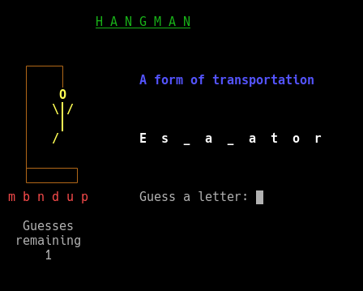

# Hangman

###### Assignment for The [Odin Project](https://www.theodinproject.com/courses/ruby-programming/lessons/file-i-o-and-serialization)

##### Enjoy


### How to play

##### Starting Hangman
```shell
 $ cd hangman
 $ ruby hangman.rb
 ```

##### The Game
* After you see the splash screen press Enter for the main screen of the game.
* You have seven attempts to guess the word or phrase shown with blanks.
* Guess one letter at a time.
* Your correct letters will be revealed in their spots in the word or phrase.
* If you guessed incorrectly the letter will appear to the left.
* To quit just type `quit` or `!`


##### Adding your own words or phrases

You can add your own list of words. Hangman searches the `assets/` directory for all `*.list` files. Just add your own in the following format.
* First line will be displayed as the Category
* Put each word or phrase on it's own line.
* save the file `assets/your_file.list`
* Note hangman randomly picks categories and words, to use only your new ones you could move the default `*.list` files to somewhere else.

###### Example
```text
A form of transportation
Aircraft
Balloon
Blimp
Bus
Bicycle
Cable Car
Car
Cart
Conveyor Belt
Escalator
```

#### TODO
- `Hangman#make_guess` needs to limit input to `[a-z]` `[A-Z]` `[space]`
- Add `save/restore` game feature

#### Future possibilities
- Add player name feature
- Add scoring mechanism, where number of points given relates to how many guesses.
- Add statistics page, where you can find out:
  - how many words you have guessed correctly/incorrectly
  - frequency of letter guesses
  - frequency of a letter in the words given so far.
